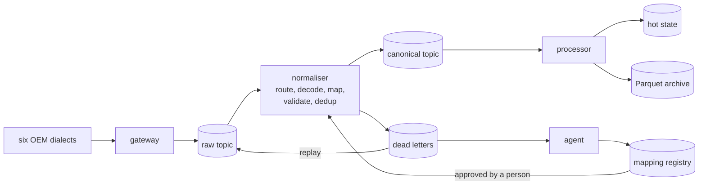

# Rosetta

**One canonical event from every car maker, and a new maker joins without downtime.**

Every connected-vehicle maker reports speed, position and battery in its own
format and its own units. Rosetta translates all of them into one canonical event
at 100,000 events per second. When a maker the platform has never seen starts
sending, or a firmware update renames a field, the unreadable messages are parked,
an agent works out the mapping and proves it on known answers, a person approves
it, and the parked messages flow through. No release, no restart, no lost data.

Built for the Connected Vehicle Intelligence hackathon, problem space
"multi-OEM data normalisation". An independent academic project: all vehicles,
people and makers in it are simulated.

To see the console, follow [Quick start](#quick-start) and open
<http://127.0.0.1:8765/app>. Screenshots, diagrams and the solution document are
build outputs and are not tracked here; [Generated files](#generated-files) has
the commands that produce them.

## Results

Measured on one laptop (Apple M4, 10 cores), ten Python processes, local mode.
Every number links to the file it comes from.

| What | Target | Measured | Evidence |
|---|---|---|---|
| Sustained throughput, 100,000 vehicles | 100,000 events/s | 100,572 sent/s, 99,364 translated/s over 90 s | [bench_steady.json](docs/evidence/bench_steady.json) |
| Ingest to dashboard | under 2 s | p50 129 ms, p95 258 ms, p99 379 ms | same |
| Events lost | none | 0 of 10,140,200 | same |
| 3x burst | survive, no loss | 0 lost; backlog 1.4 M drained 25 s after the burst; p99 latency 12 s during it | [bench_burst.json](docs/evidence/bench_burst.json) |
| Soak, 10 minutes at 50,000 events/s | stable | 30.9 M events, 0 unaccounted, 0 restarts, p99 351 ms | [bench_soak.json](docs/evidence/bench_soak.json) |
| API under load, pipeline running | p95 under 200 ms, p99 under 500 ms | p95 120 ms, p99 370 ms, 0 of 8,353 requests failed, 94 requests/s from one API process | [locust.json](docs/evidence/locust.json) |
| Processes killed with SIGKILL under load | recover | 4 killed, all restarted, 0 lost, 0 stored twice; 16,918 events redelivered after the kills, every one absorbed | [chaos.json](docs/evidence/chaos.json) |
| Field mapping on formats with unseen names | beat a baseline | 99.1% field and unit correct, against 35.8% for name matching; whole format right 96.9% against 0% | [ml_field_mapper.json](docs/evidence/ml_field_mapper.json) |
| Slowest queries | faster | 38x to 8,000x, EXPLAIN ANALYZE before and after on PostgreSQL 16 | [sql_explain.md](docs/evidence/sql_explain.md) |
| Tests | 80% coverage | 2,755 tests pass without Docker, 93.7% line coverage; 13 more against real Kafka, PostgreSQL, TimescaleDB, pgvector and Redis; 21 behaviour scenarios | [coverage.json](docs/evidence/coverage.json) |
| Contracts between services | Pact | web console to API (8 interactions), normaliser to processor and to the dead-letter worker, processor to alert subscribers (10 messages); every provider verified | [tests/contract/pacts](tests/contract/pacts) |
| Production stack in Docker Compose | one command, works | from empty volumes to 20 healthy services in 108 s; Kafka, TimescaleDB, pgvector, Redis, MinIO, EMQX, Prometheus, Loki, Tempo, Grafana | [compose_stack.json](docs/evidence/compose_stack.json) |
| MQTT gateway restarted and SIGKILLed under load | no loss | 615,464 sent, 615,464 received, 0 dropped by the broker | [compose_mqtt_restart.json](docs/evidence/compose_mqtt_restart.json) |
| Security scans | no open high or critical | bandit, Semgrep, pip-audit, npm audit, Trivy (file system and image), OWASP ZAP baseline and API scan: every gate passes after fixes | [security/README.md](docs/evidence/security/README.md) |
| Helm, Terraform, CI workflow | valid | helm lint; kubeconform against Kubernetes 1.33 (20 of 20 valid); terraform validate; actionlint; every action pin checked against its tag | [infra/VERIFICATION.md](infra/VERIFICATION.md) |
| CI on GitHub Actions | every job passes | 11 jobs green on ubuntu-24.04: lint, unit, coverage gate, integration and Pact, BDD, chaos, front end, security, infrastructure, image, ZAP | [infra/VERIFICATION.md](infra/VERIFICATION.md) (R15) |

What the numbers do not show, stated plainly in [docs/architecture.md](docs/architecture.md#scaling-and-limits-measured):
the laptop could generate about 2x, not 3x, and not for five minutes, and latency
during a burst exceeds the targets until the backlog drains. `make bench-burst` runs
the full five-minute 3x test; it needs a quiet machine with about 10 GB free.

## Quick start

Needs Python 3.11 and Node 20 or newer. No Docker, no database.

```bash
make setup          # virtual environment, Python and web dependencies, builds the UI
make run            # seeds 100,000 vehicles, starts the pipeline and the API on :8765
```

Open http://127.0.0.1:8765. The demo accounts are printed at start-up; the password
is `rosetta-demo-2026` unless `ROSETTA_DEMO_PASSWORD` says otherwise.

| Account | Role | Sees |
|---|---|---|
| engineer@rosetta.example | platform engineer | everything, approves mappings, runs the agent, runs scenarios |
| analyst@rosetta.example | analyst | read only, locations masked to about 5 km, shortened VINs |
| manager@northwind.example | fleet manager | one tenant's vehicles and drivers, precise locations |
| admin@rosetta.example | admin | everything, including personal data and erasure |

### The demo in five clicks

1. **Live**: 100,000 vehicles, five makers, one number in the middle.
2. **Make something happen, "A new maker starts sending"**: Helix Mobility comes online. Its messages are parked with `NO_ADAPTER`. Nothing is dropped.
3. **Mapping studio, Run the agent**: sample, profile (physics finds latitude, longitude and that `fahrt.v` is metres per second), propose, test, submit. Every step is shown with its input and output.
4. **Try on parked traffic, then Approve**: the draft is replayed against the real parked messages without writing anything; approval releases it and replays the parked messages.
5. **Live** again: Helix is translated, the dead-letter count falls, the workers never restarted. Then try "Firmware update": 35% of one maker's fleet switches format, and both versions run side by side.

### Production mode

```bash
cp .env.example .env    # then replace every change-me value
make up                 # Kafka (KRaft), PostgreSQL with TimescaleDB and pgvector, Redis, MinIO, EMQX, Prometheus, Grafana
```

The API is on http://127.0.0.1:8080, Grafana on :3000 (metrics, logs in Loki,
traces in Tempo, all linked). `make up-mtls` adds client
certificates for MQTT. Kubernetes: `infra/helm/rosetta`. AWS: `infra/terraform`.
What has and has not been run of the infrastructure is listed in
[infra/VERIFICATION.md](infra/VERIFICATION.md).

## How it works



- **Mappings are data, not code.** A decoder plus, per canonical field, a source path and transforms from a fixed whitelist. Compiled into a specialised function at run time. [ADR 0001](docs/adr/0001-mappings-are-data-not-code.md)
- **Hot reload, canary, replay.** A registry epoch tells workers to swap tables between two batches; versions can be live for a share of vehicles; approving a version replays what was parked. [ADR 0004](docs/adr/0004-hot-reload-canary-and-replay.md)
- **At-least-once with idempotent consumers.** A replay window per vehicle, a Bloom filter for late events, last-write-wins state, offsets stored inside each Parquet file. [ADR 0003](docs/adr/0003-at-least-once-with-idempotent-consumers.md)
- **One store per kind of data.** PostgreSQL for the 3NF core and the registry (CP), Redis for latest state (AP), Parquet for history, Kafka for streams, pgvector for mapping memory. [ADR 0002](docs/adr/0002-polyglot-storage.md)
- **The agent proposes, people decide.** Seven tools, a hold-out golden set, no power over what is live, every call audited. A deterministic engine always, Claude when a key is set. [ADR 0005](docs/adr/0005-agent-guardrails.md)

More: [architecture](docs/architecture.md), [data model and capacity](docs/data-model.md),
[algorithms with measured runtimes](docs/algorithms.md), [threat model](docs/security/threat-model.md),
[testing](docs/testing.md), [API reference](docs/api/openapi.json) (also served at `/api/docs`).

## Tests

```bash
make test           # unit, integration, contract, security, then behaviour scenarios
make coverage       # the same with coverage, fails below 80%
make test-infra     # production adapters against real Kafka, PostgreSQL, TimescaleDB, pgvector, Redis (needs Docker)
make pact           # consumer and provider sides of every Pact contract
make infra-verify   # helm lint, kubeconform, terraform validate (needs Docker)
make chaos          # SIGKILL workers under load, then check the books
make bench          # throughput at 100,000 vehicles
make bench-burst    # 3x for five minutes, then drain and account
make load           # API load test with locust, against `make run`
make security       # bandit, pip-audit, npm audit, security tests
```

## Configuration

Everything is an environment variable (see `rosetta/config.py` and `.env.example`).
The ones that switch between local and production adapters:

| Variable | Local | Production |
|---|---|---|
| `ROSETTA_BROKER` | `log` | `kafka` with `ROSETTA_KAFKA_BOOTSTRAP`; any librdkafka setting as `ROSETTA_KAFKA_CFG_*` |
| `ROSETTA_DATABASE_URL` | empty: SQLite in the data directory | `postgresql+psycopg2://...` |
| `ROSETTA_STATE_STORE` | `memory` (memory-mapped file) | `redis` with `ROSETTA_REDIS_URL` |
| `ROSETTA_ARCHIVE` | `fs` | `s3` with `ROSETTA_S3_*` (static keys optional: the default credential chain is used without them) |
| `ROSETTA_TELEMETRY_STORE` | `parquet` | `timescale` to also write the hypertable |
| `ROSETTA_JWT_SECRET` | generated per process | required, 32 characters or more; or `ROSETTA_OIDC_JWKS_URL` for an identity provider |
| `ANTHROPIC_API_KEY` | unset: deterministic agent | set: the agent is driven by Claude (`ROSETTA_LLM_MODEL`, default `claude-opus-5-5`) |

## Generated files

The repository tracks code, configuration and the measurements the numbers above
cite. Images and the submission document are build outputs, so they are not
tracked; each is produced from the code here:

| Output | Command |
|---|---|
| `docs/diagrams/*.png` (architecture, ER, deployment, layers) | `.venv/bin/python scripts/draw_diagrams.py` |
| `docs/diagrams/bench_*.png`, `ml_vs_baseline.png` | `.venv/bin/python scripts/draw_charts.py` |
| `docs/screenshots/*.png` | `make run`, then `cd web && node scripts/screenshots.mjs http://127.0.0.1:8765 ../docs/screenshots` |
| `docs/Rosetta_Solution_Document.docx` | `.venv/bin/python scripts/solution_doc/build.py` (needs the organisers' template in the repository root) |
| Raw security scan reports | `make security`; the findings are summarised in [security/README.md](docs/evidence/security/README.md) |

## Known issues

- The Claude-driven agent is tested against a stub of the API client, not against the live API: no key was available while the evidence was produced.
- The Compose stack was run end to end. The Helm chart and Terraform were checked with the real tools (lint, schema validation, `terraform validate`) but not installed on a cluster or applied to an AWS account. See [infra/VERIFICATION.md](infra/VERIFICATION.md).
- Binary formats need the OEM's schema. The agent reuses a Protobuf descriptor already registered for the source; without one it says so, records the refusal, and asks for the descriptor.
- The model is trained and evaluated on synthetic formats from one simulator. Expect lower accuracy on real feeds, which is why every proposal must pass the golden set and a person.

## Declarations

This project is released under the MIT licence ([LICENSE](LICENSE)).
Open-source components are listed in `pyproject.toml` and `web/package.json`
(`make sbom` writes the installed versions). One photograph in the console is from
Wikimedia Commons under CC BY 2.0; two images were generated with Google Gemini and
the other graphics were drawn for this project. Sources and licences are in [docs/CREDITS.md](docs/CREDITS.md). AI tools used: Claude (Anthropic) as a coding
assistant for implementation, tests and documentation; the Claude API is an
optional runtime component of the agent. All data is synthetic.
