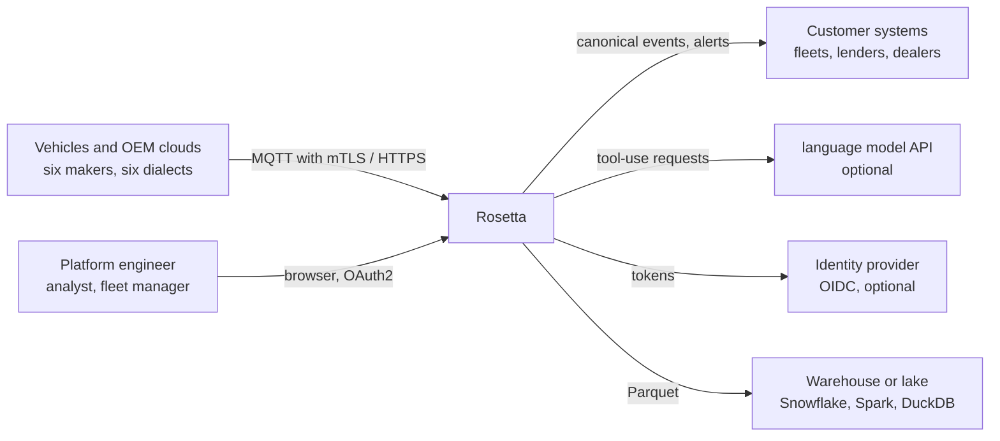
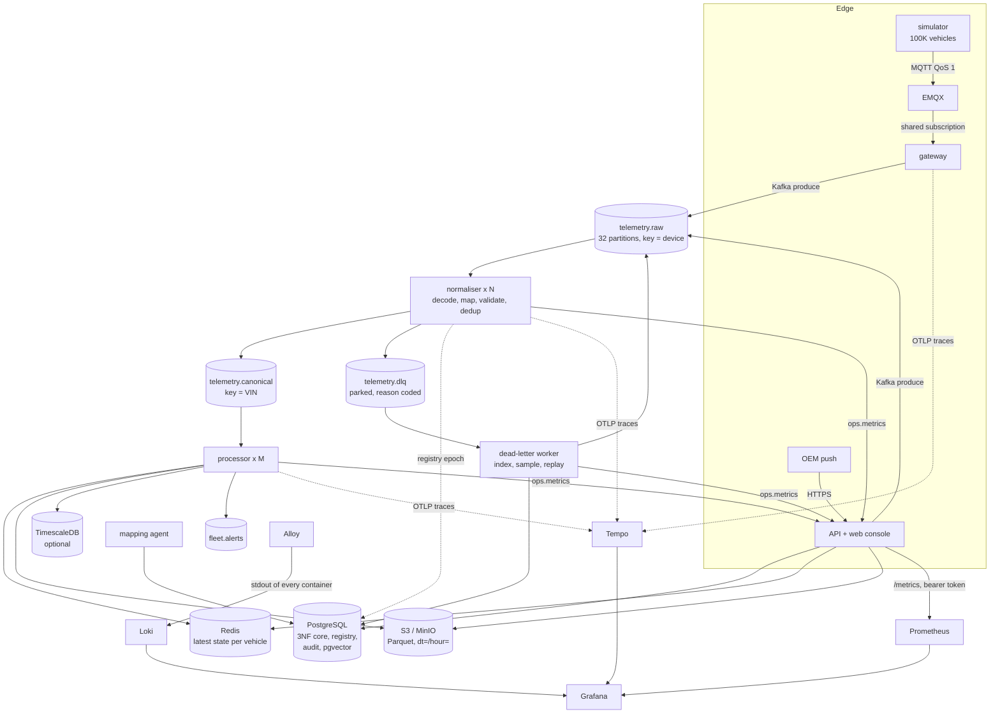
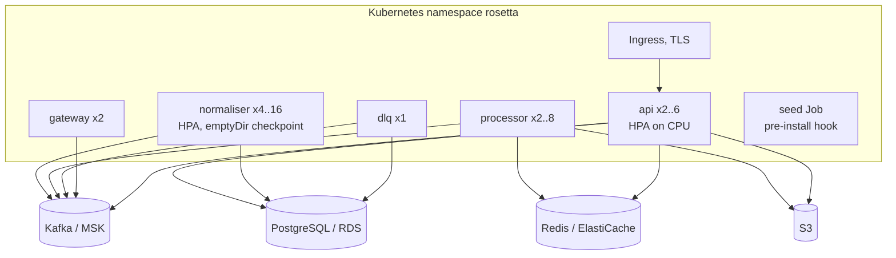

# Architecture

## System context (C4 level 1)



## Containers (C4 level 2)



Every arrow into or out of a store goes through a port in `rosetta/ports/` with a
local adapter and a production adapter. The local mode (`python -m rosetta up`)
replaces Kafka with a file-backed partitioned log, PostgreSQL with SQLite, Redis
with a memory-mapped file and S3 with the local disk. The code above the ports is
the same in both modes.

## The path of one event, with the latency of each hop

Measured on the development laptop at 100,000 events per second
(`docs/evidence/bench_steady.json`). The overall figure is measured directly,
from the receive stamp at the gateway to the moment the event is visible in the
hot state. The per-hop split is from the batch timings the workers report.

| Hop | What happens | Typical |
|---|---|---|
| vehicle to gateway | MQTT publish, TLS 1.3, QoS 1 | network |
| gateway | stamp receive time, back-pressure check, append to raw topic keyed by device | under 5 ms |
| raw topic to normaliser | poll in batches of up to 4,000 | up to the batch interval |
| normaliser | route, decode, map, validate, de-duplicate, produce | 10 µs per event |
| canonical topic to processor | poll in batches of up to 5,000 | up to the batch interval |
| processor | parse the batch into Arrow columns, update hot state, raise alerts | 10 µs per event |
| **ingest to dashboard** | **gateway receive to hot state** | **p50 129 ms, p95 258 ms, p99 379 ms** |

Target from the problem statement: under 2 s to the dashboard and under 5 s for a
critical alert. Both hold in steady state. During a burst the backlog adds queueing
delay (see "Scaling and limits").

## At the edge: MQTT without loss

A vehicle's QoS 1 publish is acknowledged by EMQX, not by Rosetta, so the vehicle
will not send it again. From then on the broker and the gateway own it:

- The gateway subscribes through a shared subscription (`$share/gateway/...`), so
  replicas split the traffic.
- It acknowledges a message only after the batch holding it is in Kafka (manual
  acknowledgement). A gateway that dies before that leaves it unacknowledged, and
  EMQX delivers it again; the normaliser drops the duplicate.
- Its MQTT 5 session is persistent and its client id is stable
  (`ROSETTA_MQTT_CLIENT_ID`), so a restarted gateway takes back the messages EMQX
  queued for it meanwhile. The session expires after 5 minutes, so an id that never
  returns stops receiving a share.
- EMQX is sized for that: 4,096 messages in flight per session and a queue of
  200,000 (about 40 s of the Compose simulator's traffic).

Measured in the Compose stack with a graceful restart and a SIGKILL of the gateway
under load: 615,464 sent, 615,464 received, 0 dropped by EMQX
(`docs/evidence/compose_mqtt_restart.json`). Before these changes the same
procedure lost about 2.8%.

## Observability

| Signal | Path | Where to look |
|---|---|---|
| Metrics | workers publish to `ops.metrics` each second, the API aggregates and serves `/metrics` (bearer token), Prometheus scrapes every 5 s | Grafana dashboard "Rosetta pipeline", 12 alert rules in `infra/prometheus/alerts.yml` |
| Logs | every process writes one JSON object per line to stdout; Alloy reads the container logs and ships them to Loki with `level` as a label and `trace_id` as structured metadata | Grafana Explore, Loki |
| Traces | one batch in 200 is traced (`ROSETTA_TRACE_RATIO`); the W3C `traceparent` travels in Kafka record headers, so gateway, normaliser and processor spans join into one trace; OTLP/HTTP to Tempo | Grafana Explore, Tempo; a log line links to its trace |

The alert `RosettaWorkersGone` watches `rosetta_workers_reporting`: consumer lag
is a sum over the workers that report, so it reads 0 when every worker is gone,
and only this gauge tells "idle" from "dead".

## Inside a service: layers

The normaliser is the most important service. Its layers, and the rule that
dependencies point inwards only:

| Layer | Modules | Knows about | Must not |
|---|---|---|---|
| Domain | `domain/canonical.py`, `transforms.py`, `vin.py`, `dtc.py`, `errors.py` | nothing else | import a framework or a store |
| Engine (application) | `engine/compiler.py`, `codegen.py`, `router.py`, `normalizer.py`, `dedup.py` | domain, algorithms | know which broker or database is in use |
| Ports | `ports/broker.py`, `ports/stores.py` | nothing | contain logic |
| Adapters (infrastructure) | `adapters/kafka_broker.py`, `log_broker.py`, `hot_state.py`, `archive.py`, `timescale.py`, `redis_store.py` | ports | leak vendor types upwards |
| Process shell | `pipeline/normalizer_worker.py` | all of the above, through `factory.py` | contain business rules |

`Normalizer.process()` takes records and returns records. It has no idea whether
they came from Kafka, which is why the same code runs in the unit tests, the local
mode and production.

## Repository

```
rosetta/            the Python package
  domain/           canonical event, VIN, DTC, whitelisted transforms
  algorithms/       Bloom, replay window, Count-Min, geohash, DP segmentation, Hungarian, union-find
  engine/           decoders, spec compiler, code generation, router, normaliser, dedup
  ports/ adapters/  interfaces and their local and production implementations
  pipeline/         gateway, MQTT gateway, workers, metrics, supervisor
  simulator/        100K-vehicle fleet, six dialects, fault injection
  ml/               field profiling, synthetic dialects, classifier, baseline, training
  agent/            toolbox, deterministic workflow, model-driven tool-use loop, vector memory
  services/         registry, golden sets, audit chain, erasure, seeding
  api/              FastAPI app, security, routers
  batch/            analytics over the Parquet archive
web/                React console (Vite, TypeScript, Leaflet)
tests/              unit, integration, contract, security, bdd, chaos, load
infra/              Docker, Compose, Helm, Terraform (AWS), Prometheus, Grafana, EMQX, SQL
docs/               this file, ADRs, data model, algorithms, threat model, evidence
scripts/            benchmarks, OpenAPI export, SQL optimisation, certificates
```

## Deployment



Stateless services scale horizontally: adding normaliser replicas needs no code
change, Kafka's consumer group redistributes the 32 partitions. Pod disruption
budgets and topology spread keep replicas on different nodes. Secrets come from a
Kubernetes Secret or an external secret store, never from the image.

### The same deployment on another cloud

The application has no cloud SDK. It speaks Kafka, PostgreSQL, Redis, the S3 API
and OIDC. On GCP: Managed Kafka or Confluent, Cloud SQL, Memorystore, GCS through
its S3 interoperability endpoint (`ROSETTA_S3_ENDPOINT`), GKE. On Azure: Event Hubs
Kafka endpoint (`ROSETTA_KAFKA_CFG_SECURITY_PROTOCOL=SASL_SSL` and friends),
Azure Database for PostgreSQL, Azure Cache for Redis, MinIO or an S3 gateway, AKS.
The Helm chart is unchanged; only its values differ. Terraform is written for AWS
only (`infra/terraform/README.md`).

## Scaling and limits, measured

| Scenario | Result | Evidence |
|---|---|---|
| 100,000 vehicles at 1 event per second, 90 s | 100,572 sent per s, 99,364 normalised per s, p99 ingest to dashboard 379 ms, 10.1 M events, 0 unaccounted | `bench_steady.json` |
| Burst: 3x requested for 20 s | the simulator reached about 200,000 per s on this laptop, the pipeline caught up at 150,000 to 175,000 per s, peak backlog 1.4 M events, drained 25 s after the burst, 0 unaccounted. Latency during the burst rose to 12 s at p99 | `bench_burst.json` |
| Soak, 50,000 per s for 10 minutes | 30.9 M events, 0 unaccounted, 0 restarts, p99 351 ms; worker memory moves within about 20 MB, the simulator drifts about 60 MB | `bench_soak.json` |
| SIGKILL on four processes under load | all restarted, 0 events lost, 0 stored twice | `chaos.json` |

All of this ran on one laptop (Apple M4, 10 cores) with ten Python processes and
the file-backed broker. A 3x burst for five minutes, as the problem statement asks,
needs either more cores to absorb it in real time, or several GB of broker
retention to queue it. `make bench-burst` runs exactly that test. An attempt on
30 September was stopped after two minutes: with the disk 95% full and other
workloads on the machine, the same code reached only half its earlier steady
throughput, so the run would have measured the host, not the pipeline. The 20 s
burst above is the evidence until it is repeated on a quiet machine. On a cluster the arithmetic is: one
normaliser core handles about 25,000 events per second, so 300,000 per second needs
12 normaliser cores plus headroom, which the HPA limit of 16 replicas covers.
