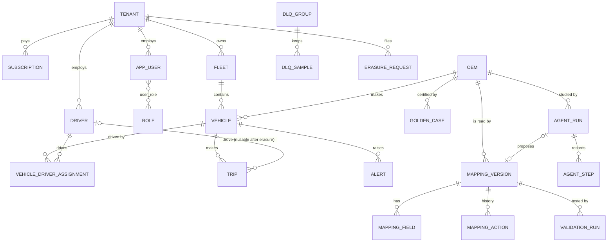

# Data model

## Relational core, Third Normal Form

26 tables in `rosetta/db/models.py`. The design rules:

- **1NF.** Every column holds one value. Trouble codes of a trip are not a
  comma-separated column: they live in the telemetry store. Multi-valued facts
  get their own table (`user_role`, `vehicle_driver_assignment`, `mapping_field`).
- **2NF.** Every non-key column depends on the whole key. `user_role` has only its
  composite key. `metric_minute` (key: source and minute) holds only facts about
  that source in that minute.
- **3NF.** No non-key column depends on another non-key column. A vehicle stores
  `fleet_id`, not the fleet's tenant or name: the tenant is reached through the
  fleet. Personal data lives only in `driver`, so erasure has one place to act.
- **Temporal facts** are rows with validity, not overwritten columns:
  `vehicle_driver_assignment.valid_from / valid_to`, `subscription.valid_from / valid_to`.
- **Constraints in the database**, not only in code: unique VIN and device id,
  VIN length, canary percentage 0 to 100, non-negative price and quota, unique
  (source, version), unique alert (vehicle, kind, event time) which also makes
  alert inserts idempotent, foreign keys with deliberate `ON DELETE` rules
  (`CASCADE` for owned rows, `SET NULL` for trip to driver so erasure keeps trips).
  `tests/integration/test_infra.py` checks that PostgreSQL rejects violations.

### Deliberate denormalisation

| Where | What is duplicated | Why |
|---|---|---|
| `mapping_version.spec` | the whole spec as JSON, next to the normalised `mapping_field` rows | a worker compiles a version from one read; the field rows serve queries, reviews and diffs |
| `dlq_group.sample` | one example payload per group | the dead-letter list shows an example without a second query |
| `metric_minute` | per-minute counts that could be recomputed from the stream | charts over hours without scanning events |
| `mv_fleet_mix` (PostgreSQL) | vehicles per source and powertrain | a materialised view: 25 ms to 0.003 ms, refreshed when vehicles change |

## Polyglot map

See ADR 0002 for the reasoning and the CAP choice per store.

| Store | Holds | Consistency |
|---|---|---|
| PostgreSQL (SQLite locally) | the tables above, pgvector embeddings | CP |
| Kafka (file log locally) | raw, canonical, dead-letter, alert, metrics and control topics | AP within partitions, per-key order |
| Redis (memory-mapped file locally) | latest state of each vehicle, late-event de-duplication keys | AP, last write wins by event time |
| Parquet on S3 (local disk locally) | every canonical event, partitioned `dt=YYYY-MM-DD/hour=HH` | append-only, eventually complete |
| TimescaleDB (optional) | the same events as a hypertable with compression and a continuous aggregate | as PostgreSQL |

## Telemetry partitioning

| Store | Partition key | Why it avoids hot spots |
|---|---|---|
| raw topic | device id, 32 partitions | 100,000 devices hash evenly; per-device order is what de-duplication needs |
| canonical topic | VIN, 32 partitions | per-vehicle order for the hot state and alerts |
| dead-letter topic | source, 6 partitions | replay reads one source at a time |
| Parquet | date and hour directories, rows sorted by VIN inside each file | time pruning by directory, vehicle pruning by row-group statistics |
| TimescaleDB | time chunks, space partitioning on VIN | time-range queries touch few chunks, writes spread over partitions |

## Capacity estimate

| Quantity | Value | Basis |
|---|---|---|
| vehicles | 100,000 | problem statement |
| events per second | 100,000 sustained, 300,000 burst | 1 per vehicle per second, 3x at shift start |
| raw payload | 60 to 390 bytes, mean about 250 | measured per dialect (`kaizen` Protobuf 62, `nordvik` nested JSON 391) |
| raw volume per day | about 2.2 TB | 100,000 × 86,400 × 250 bytes |
| archived bytes per event | 41.8 | measured: Parquet with zstd, sorted by VIN |
| archive per day | about 360 GB | 8.64 billion events × 41.8 bytes |
| archive per year | about 130 TB | before down-sampling of cold data |

### Hot, warm, cold

| Tier | Store | Resolution | Retention | Cost at AWS list prices, per month |
|---|---|---|---|---|
| hot | Redis | latest event per vehicle, about 9.2 MB | always | a small cache node, about 50 USD |
| hot | Kafka | every event, raw and canonical | 24 h (raw), 72 h (canonical), 14 days (dead letters) | 3 brokers with about 12 TB of storage, about 3,000 USD |
| warm | S3 Standard, Parquet | every event | 90 days, about 32 TB | about 750 USD |
| cold | S3 Glacier Instant Retrieval, Parquet | down-sampled to one event per vehicle per 10 s after 90 days | 13 months, about 15 TB | about 60 USD |

Costs are estimates for planning, from public list prices, not quotes. The biggest
lever is the Kafka retention: dead letters need days (a person has to write or
approve a mapping), raw events need hours.
