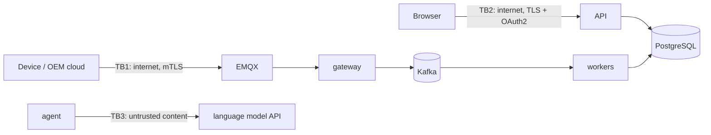

# Threat model (STRIDE)

Scope: the ingestion path (vehicle or OEM cloud to the raw topic) and the public API.
Assets: vehicle location and identity, driver identity, the mapping registry (which
decides what every event means), and the audit trail.

## Data flow and trust boundaries

## STRIDE, per element

| # | Threat | Where | Control | Evidence |
|---|---|---|---|---|
| S1 | A device publishes as another device | TB1 | mTLS: the client certificate's common name is bound by the broker ACL to `oem/<source>/<device>/telemetry` | `infra/emqx/acl.conf`, `scripts/make_certs.sh`, TLS 1.3 minimum in `mqtt_gateway.py` |
| S2 | Forged API token, `alg: none`, wrong key, expired token | TB2 | HS256 with a fixed algorithm list and required claims, or RS256 through OIDC; secret of 32+ characters required outside local mode | `tests/security` (nine token variants rejected) |
| S3 | Password guessing | TB2 | Argon2id hashes, per-account-and-address throttling (5 tries then 1 per 6 s), identical message for unknown user and wrong password, dummy hash verified for unknown users so timing does not leak | `test_login_failures_look_the_same`, `test_login_is_rate_limited` |
| T1 | A mapping that silently mistranslates (malicious or mistaken) | registry | Mappings are data from a whitelist (ADR 0001); drafts must pass the golden set including a hold-out half; only people approve; canary release with automatic rollback | `tests/integration/test_services.py`, `test_a_bad_canary_never_hurts_traffic` |
| T2 | Code injection through a mapping spec | engine | No eval of spec content; code generation embeds only `repr` of validated literals; unknown keys, ops and parameters rejected | `test_a_spec_that_does_not_compile_is_never_stored` (eval, `__import__`, shell strings) |
| T3 | Editing or deleting audit history | database | Hash chain: each row stores SHA-256 of the previous row and itself; `verify` names the first broken row; PostgreSQL advisory lock keeps the chain linear under concurrent writers | `test_chain_detects_deleted_row`, `test_audit_chain_survives_concurrent_writers` |
| T4 | Tampered or truncated payload in transit | TB1 | TLS; malformed payloads are dead-lettered with a reason, never half-applied; torn writes in the log are repaired | `test_oversize_and_garbage_do_not_stop_the_worker` |
| R1 | An engineer denies approving a mapping; the agent's actions are unclear | registry, agent | Every transition writes a `mapping_action` and an audit entry in the same transaction; every agent tool call is stored with input, output and duration | `test_workflow_maps_the_demo_cases` (one audit entry per step) |
| I1 | A fleet manager reads another tenant's vehicles or drivers | API | Tenant id comes from the token, never the request; every query filters by it; other tenants' objects answer 404, not 403 | `test_other_tenants_vehicle_is_invisible` and three more |
| I2 | An analyst sees precise locations or VINs | API | Positions snapped to a 5-character geohash cell centre, VINs shortened to 6 characters, vehicle detail and history refused | `test_analyst_gets_masked_data` |
| I3 | Secrets or internals in logs and errors | API | JSON logs redact keys containing password, token, secret, authorization, api key; RFC 9457 errors without stack traces or paths | `test_secrets_never_reach_the_logs`, `test_errors_do_not_leak_internals` |
| I5 | Scraping operational metrics (sources, rates, error reasons) | `/metrics` | Bearer token `ROSETTA_METRICS_TOKEN`, compared in constant time; Prometheus reads it from a Compose secret, the ServiceMonitor from the release Secret | `test_metrics_token_is_required_when_configured` |
| I6 | Script injection in the console or the API docs page | browser | Page CSP without `'unsafe-inline'` for scripts or styles; the API's own responses `default-src 'none'`; the Swagger page gets its own CSP that allows only the pinned CDN path and its one inline script by SHA-256 hash | `test_api_docs_page_has_its_own_narrow_csp`, `test_security_headers*` |
| I4 | Prompt injection through payload text reaching the model | TB3 | Payload text only inside tool results, as data; the system prompt says so; the agent has no tool that changes production; whatever it concludes must pass the golden set and a person | `test_prompt_injection_in_payloads_cannot_reach_production` |
| D1 | Flooding the intake | TB1 | Back-pressure with hysteresis at the gateway (producers told to wait, QoS 1 holds messages at the broker); payload size limits (64 KB per message, 4 MB per HTTP body) | `test_large_bodies_are_refused`, gateway unit tests |
| D3 | Losing messages when the gateway restarts or dies | edge | Manual MQTT acknowledgement after the batch is in Kafka; persistent session with a stable client id; broker queue sized for a restart | `tests/unit/test_mqtt_gateway.py`; 615,464 of 615,464 in `docs/evidence/compose_mqtt_restart.json` |
| D2 | Flooding or scraping the API | TB2 | Token-bucket rate limit per caller, capped page sizes and query ranges, keyset pagination | `test_limits_are_capped` (eight cases) |
| E1 | A read-only role changes mappings, runs the agent or kills processes | API | Role checks on every mutating endpoint; the registry refuses non-human actors a second time, below the API | `test_read_only_roles_cannot_change_anything` (ten endpoints × two roles) |
| E2 | The agent approves its own draft | registry | `ALLOWED_ACTORS`: approve, promote, retire, reject are `user` only; rollback `user` or `system` | `test_agent_can_never_change_what_runs` (five actions) |

## OWASP API Security Top 10 (2023)

`tests/security/test_api_security.py` is organised by these categories: broken
object level authorisation (API1), authentication (API2), object property level
authorisation (API3, masking and mass assignment: unknown fields are refused, not
ignored), resource consumption (API4), function level authorisation (API5), SSRF
(API7: no endpoint accepts a URL), misconfiguration (API8: security headers, CORS
allow-list), inventory (API9: every operation requires a token unless listed as
public, checked against the OpenAPI document) and injection.

## Not covered, and what would cover it

- Scans were run locally and are in CI: SAST (bandit, Semgrep), dependencies
  (pip-audit, npm audit), Trivy on the file system and the image, OWASP ZAP
  baseline and an authenticated API scan. Results, fixes and the triage of what
  remains: `docs/evidence/security/README.md`.
- Kafka to MSK in plain text inside the VPC (Trivy AWS-0073, accepted): the client
  supports TLS and SASL through `ROSETTA_KAFKA_CFG_*`, not yet exercised.
- Encryption at rest is a property of the managed stores (RDS, MSK, ElastiCache,
  S3 with KMS in `infra/terraform`); the local mode does not encrypt its files.
- Secrets management in production is the platform's (Kubernetes Secrets or an
  external secret store); the chart references a Secret and never creates one.
